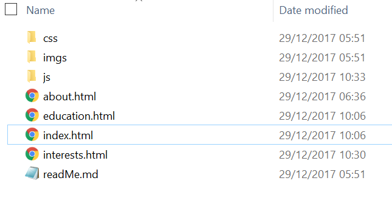
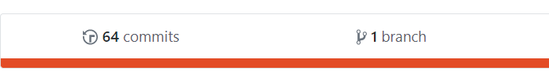

# CTEC3903 Front End Web Development

## Portfolio 

> Charlie Preece - P15221433

### 1. Choice of Wesbite

  >  I chose to produce a portfolio website because it can be used as evidence to show my ability to produce responsive websites.

  > The Link to my original website can be found below:

   > GitHub Repo: https://github.com/Front-end-development-2017/Assignment-2

   > Github pages: https://front-end-development-2017.github.io/Assignment-2/

***

### 2. Wireframe Sketches

> The following is a general layout for my pages.

Mobile Wireframe

[Mobile Wireframe](https://i.imgur.com/snJptSg.jpg)

Tablet Wireframe

[Tablet Wireframe](https://i.imgur.com/hpMJSms.jpg)

Desktop View

[Desktop Wireframe](https://i.imgur.com/de9Gfzt.jpg)

***

### 3. Responsive Layout 

#### Mobile View 

[Mobile View](https://i.imgur.com/RRUZpve.png)

#### Tablet View 

[Tablet View](https://i.imgur.com/K52GsHT.png)

#### Desktop View 

[Desktop View](https://i.imgur.com/zmxrREf.png)

#### Testing Scalibility 

[Scale Example 1](https://i.imgur.com/IiF7Lr5.jpg)

[Scale Example 2](https://i.imgur.com/H4iD5Tj.jpg)

***

### 4. Nav and Footer (Including Sitemap)

> Nav bar included in all pages 

[Nav Bar](https://i.imgur.com/6AsJpE3.png)

> footer included in all pages including the site map

[Footer](https://i.imgur.com/RgtXgrp.png)
 
 ***
 
### 5. Folder Layout

***

### 6. HTML Validation

Index.html 

About.html 

Education.html

Interests.html

***

### 7. Use of Flickr API

Flickr API 

Responsive API on mobile

Responsive API on Tablet

Responsive API on Desktop

***

### 8. Html Indentation

***

### 9. Html Sementics

***

### 10. CSS Syntax and Flex

Used flex often to style my content (Has benefits of being reusable in other pages)

***

### 11. CSS Breakpoints

I created a seperate css file called responsive.css that holds tablet and desktop breakpoints

***

### 12. Use of Javascript

The index.html has a slideshow animation of four images using javascript.

The burger icon is a SVG image that nests the navigation inside it when in tablet or mobile view. Clicking/tapping it open the navigation.

This arrow icon is a SVG image. When clicked/tapped it automatically scrolls to page back to the top.

***

### 13. Commit History

***

### 14. Branching 

 

***

### 15. References 

> Slide animation:
    https://www.w3schools.com/howto/howto_js_slideshow.asp

> Scroll to Top: 
    https://codepen.io/choogoor/pen/dGpOoW?q=scroll%20to%20top%20&order=popularity&depth=everything&show_forks=false

>Flickr API:
    https://github.com/CTEC3905/08-lab-json-ajax/tree/flickr

>FlexBox Cheatsheet:
    https://daveeveritt.github.io/flexbox-cheatsheet/

>GitHub Walkthrough: https://vle.dmu.ac.uk/webapps/blackboard/execute/content/file?cmd=view&content_id=_3790096_1&course_id=_460483_1&framesetWrapped=true

***

### 16. Reflection 

* Great to understand how code HTML5 properly using sementics
* Mobile first design using breakpoints makes life as a web developer far easier than before.
* Learning Javascript has been tough but essential to my learning 
* Using an API for the first time has been great to learn and use effectively, because before I had little knowledge of API's.
* Overall this module has given me some great tips to enhanace my programming knowledge. 
* Will use markdown again for other modules in place of Powerpoint.

### 17. Future Use

1. Use sementic HTML with appropiate indentation.
2. Use Mobile first approach with breakpoints and appropiate indentation.
3. Use of javascript for responsiveness such as animations and event listeners and **NOT** click events.
4. Use of an API to pull in external JSON as there no point reinventing the wheel if it's already available.
5. Use Github to host future sites and for anywhere accesibility.
6. Use git Bash for programming because commits and branches are valuable to revert mistakes I have learnt e.g git resit --hard **commit id**.